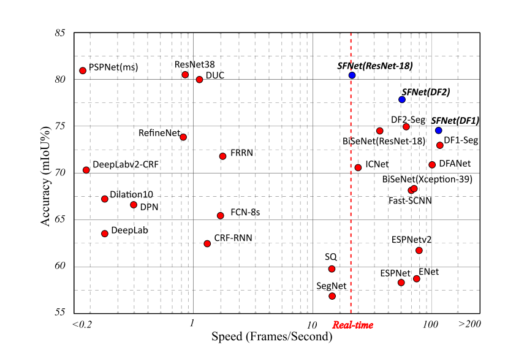

# SFSegNets(ECCV-2020-oral)
Reproduced Implementation of Our ECCV-2020 oral paper: Semantic Flow for Fast and Accurate Scene Parsing.
**SFnet is the first real time nework which achieves the 80 mIoU on Cityscape test set!!!!**
It also contains our another concurrent work: SRNet:[link](https://arxiv.org/abs/2011.03308).


Our methods achieve the best speed and accuracy trade-off on multiple scene parsing datasets.  


Note that the original paper link is on [TorchCV](https://github.com/donnyyou/torchcv) where you can train SFnet models. 
However, that repo is over-complex for further research and exploration.

## Question and Dissussion 

If you **have any question and or dissussion on fast segmentation**, just open an issue. I will reply asap if I have the spare time.

## DataSet Setting
Please see the DATASETs.md for the details.


## Requirements

pytorch == 1.2.0 or 1.3.0
apex
opencv-python

## Pretrained models and Trained CKPTs
Please download the pretrained models and put them into the pretrained_models dir on the root of this repo.

### pretrained imagenet models

resnet101-deep-stem-pytorch:[link](https://drive.google.com/file/d/11s2vaTV71Lc160TMulrmodletcEgRYqi/view?usp=sharing)

resnet50-deep-stem-pytorch:[link](https://drive.google.com/file/d/1H2LhFcDZy6-4K5Yfs-8mHbTSe3WdaTrd/view?usp=sharing)

resnet18-deep-stem-pytorch:[link](https://drive.google.com/file/d/16mcWZSWbV3hkFWJ2cP_eJRQ6Nr1BncCp/view?usp=sharing)

dfnetv1:[link](https://drive.google.com/file/d/1xkkmIjKUbMifcrKdWU7I_-Jx_1YQAXfN/view?usp=sharing)

dfnetv2:[link](https://drive.google.com/file/d/1ZRRE99BPhbXwq-ZzO8A5GFmfCe7zxMsz/view?usp=sharing)

### trained ckpts:

sf-resnet18-Mapillary:[link](https://drive.google.com/file/d/1Hq7HhszrAicAr2PnbNN880ijAYcxJJ0I/view?usp=sharing)


Please download the trained model, the mIoU is on Cityscape validation dataset.

resnet18(no-balanced-sample): 78.4 mIoU 

resnet18: 79.0 mIoU [link](https://drive.google.com/file/d/1X7w1HYrSXOJBkfRJuxtXdmR0BXUR-hR8/view?usp=sharing)
+dsn [link](https://drive.google.com/file/d/1-U6NzJ0vb3q4Ev7YZ5FkL9X0L__bozM2/view?usp=sharing)

resnet18 + map: 79.9 mIoU [link](https://drive.google.com/file/d/1wiJC_skx8MaZD6B0waz0CWnQBUlcQ6UD/view?usp=sharing) 

resnet50: 80.4 mIoU [link](https://drive.google.com/file/d/1oAOPISp_Rqva_9whsF7eE3pFxuGSc1Wf/view?usp=sharing)

resnet101: 81.2 mIoU [link](https://drive.google.com/file/d/1YPLBTnMit-ybR5pwUhjs-y4KMoT9CvPc/view?usp=sharing)

dfnetv1: 72.2 mIoU [link](https://drive.google.com/file/d/1aP9d4QVbGvBTABOFvi-okOs6DmJU8njH/view?usp=sharing)

dfnetv2: 75.8 mIoU [link](https://drive.google.com/file/d/1iGE9IYImdrs5p0i3k85OoCQzuSUNhjNU/view?usp=sharing)


## Demo 

### Visualization Results

python demo_folder.py --snapshot ckpt_path --demo_floder images_folder --save_dir save_dir_to_disk


## Training 

The train settings require 8 GPU with at least **11GB** memory. 
Please download the pretrained models before training.

Train ResNet18 model
```bash
sh ./scripts/train/train_cityscapes_sfnet_res18.sh
```

Train ResNet101 models

```bash
sh ./scripts/train/train_cityscapes_sfnet_res101.sh
```

## Submission for test 

```bash
sh ./scripts/submit_test/submit_cityscapes_sfnet_res101.sh
```


## Citation
If you find this repo is useful for your research, Please consider citing our paper:


```
@inproceedings{sfnet,
  title={Semantic Flow for Fast and Accurate Scene Parsing},
  author={Li, Xiangtai and You, Ansheng and Zhu, Zhen and Zhao, Houlong and Yang, Maoke and Yang, Kuiyuan and Tong, Yunhai},
  booktitle={ECCV},
  year={2020}
}

@article{Li2020SRNet,
  title={Towards Efficient Scene Understanding via Squeeze Reasoning},
  author={Xiangtai Li and Xia Li and Ansheng You and Li Zhang and Guang-Liang Cheng and Kuiyuan Yang and Y. Tong and Zhouchen Lin},
  journal={ArXiv},
  year={2020},
  volume={abs/2011.03308}
}

```

## Acknowledgement 
This repo is based on Semantic Segmentation from [NVIDIA](https://github.com/NVIDIA/semantic-segmentation) and [DecoupleSegNets](https://github.com/lxtGH/DecoupleSegNets)

Thanks to **SenseTime Research** for Reproducing All these model ckpts and pretrained model.

